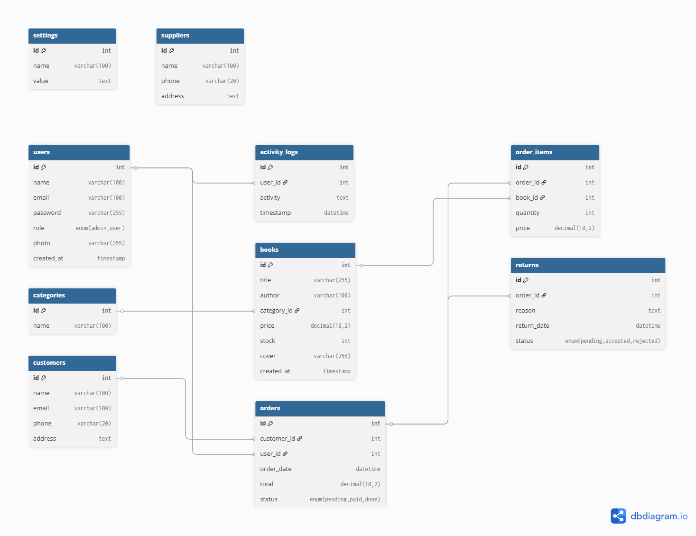

# 📚 Literaid - Aplikasi Web Toko Buku

Literaid adalah aplikasi web toko buku berbasis PHP dan MySQL yang dirancang untuk memudahkan pengelolaan data buku, transaksi penjualan, pelanggan, serta pelaporan. Aplikasi ini mendukung peran admin dan pengguna biasa, dengan antarmuka responsif menggunakan Bootstrap.

---

## 1️⃣ Cara Instalasi Aplikasi

### 🔧 Persyaratan Sistem
- Web Server: Apache (disarankan XAMPP)
- PHP: Versi 7.4 atau lebih tinggi
- MySQL: Versi 5.7 atau lebih tinggi
- Browser modern (Chrome, Firefox, dll.)

### 📦 Langkah-langkah Instalasi
1. **Clone atau Unduh Proyek**
   ```bash
   git clone https://github.com/lea4444/Proyek-UAS-PemWeb-202312022.git
   cd literaid
   ```

2. **Pindahkan Folder ke `htdocs` (jika pakai XAMPP)**
   Letakkan folder `literaid/` ke dalam `C:/xampp/htdocs/`.

3. **Import Database**
   - Buka `phpMyAdmin`
   - Buat database baru bernama `literaid`
   - Import file `sql/literaid.sql`

4. **Jalankan Aplikasi**
   Buka browser dan akses:
   ```
   http://localhost/literaid/
   ```

---

## 2️⃣ Struktur Database & ERD

### 📂 Tabel Utama
- `users` – Menyimpan data admin dan pengguna biasa
- `books` – Daftar buku toko
- `categories` – Kategori buku
- `customers` – Data pelanggan
- `orders` – Data transaksi
- `order_items` – Detail buku per pesanan
- `returns` – Pengajuan pengembalian buku
- `suppliers` – Data pemasok buku
- `settings` – Pengaturan aplikasi
- `activity_logs` – Log aktivitas admin

### 🔗 Relasi Antar Tabel
- `orders.customer_id` → `customers.id`
- `orders.user_id` → `users.id`
- `order_items.order_id` → `orders.id`
- `order_items.book_id` → `books.id`
- `books.category_id` → `categories.id`
- `books.supplier_id` → `suppliers.id`
- `returns.order_id` → `orders.id`

### 📊 ERD (Entity Relationship Diagram)



---

## 3️⃣ Cara Menggunakan Aplikasi

### 🔑 Login
- Masuk melalui halaman login (`auth/login.php`)
- Role `admin` dan `user` akan diarahkan ke dashboard masing-masing

### 👩‍💼 Fitur untuk Admin
- Dashboard statistik
- Manajemen Data (CRUD):
  - Buku
  - Kategori
  - User
  - Supplier
  - Pelanggan
- Monitoring:
  - Transaksi & Riwayat Pesanan
  - Pengajuan Pengembalian
- Log Aktivitas
- Laporan Transaksi & Cetak Struk

### 👩‍🎓 Fitur untuk User
- Belanja Buku (lihat & tambahkan ke keranjang)
- Riwayat Pesanan
- Ajukan Pengembalian Buku
- Kelola Profil dan Foto
- Ubah Password

---

## 🗂️ Struktur Folder

```
literaid/
├── admin/               → (Opsional) Halaman admin
├── assets/              → CSS, JS, gambar
├── auth/                → Login, logout, proteksi
├── config/              → Konfigurasi database
├── docs/                → Dokumentasi & ERD
├── includes/            → Header, footer, dll
├── modules/             → Modul CRUD (books, users, etc.)
├── sql/                 → Struktur database SQL
├── uploads/             → Gambar buku dan profil
├── user/                → Fitur dashboard user biasa
├── index.php            → Landing page
└── README.md            → Dokumentasi proyek
```

---

## 👥 Akun Default

| Role  | Email              | Password   |
|-------|--------------------|------------|
| Admin | admin@example.com  | admin123   |
| User  | user@example.com   | user123    |

---

## 💻 Teknologi

- PHP 7.4+
- MySQL 5.7+
- Bootstrap 4/5
- HTML5, CSS3, JavaScript (vanilla)

---

## 🧪 Demo Aplikasi

🎬 **Tonton Demo Video**
> [Klik di sini untuk menonton](https://example.com/demo-video)

🌐 **Coba Aplikasi**
> [Klik di sini untuk akses demo online](https://example.com/demo-site)

---

## 📌 Contoh Commit Message

```bash
[Fitur] Tambah checkout dan keranjang
[Fix] Perbaiki validasi login user
[Update] Tampilan laporan admin
[Docs] Tambah README dan struktur SQL
```

---

## 🧾 Lisensi

Proyek ini dibuat sebagai bagian dari tugas Ujian Akhir Semester dan pembelajaran pribadi.

- 🚫 Tidak diperbolehkan dikomersialkan tanpa izin tertulis.
- ✅ Diperbolehkan digunakan untuk tujuan edukatif, tugas kuliah, atau referensi, dengan mencantumkan sumber.
- 🛠 Aplikasi ini disediakan "apa adanya" tanpa jaminan atau dukungan resmi.

---

## 📬 Kontak

- **Nama:** Vilea Fernanda  
- **NIM:** 202312022  
- **Program Studi:** Teknik Informatika  
- **Email:** vileafrnd@gmail.com  
- **GitHub Repo:** [https://github.com/lea4444/Proyek-UAS-PemWeb-202312022]